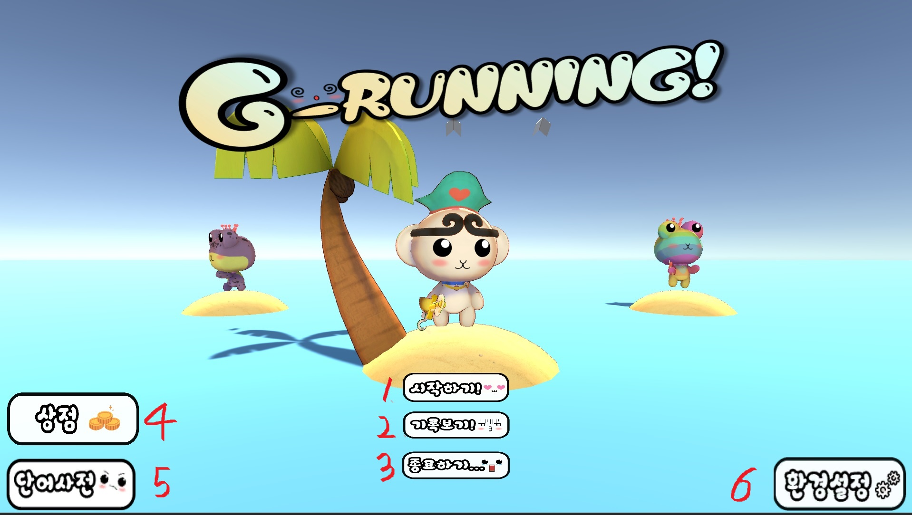
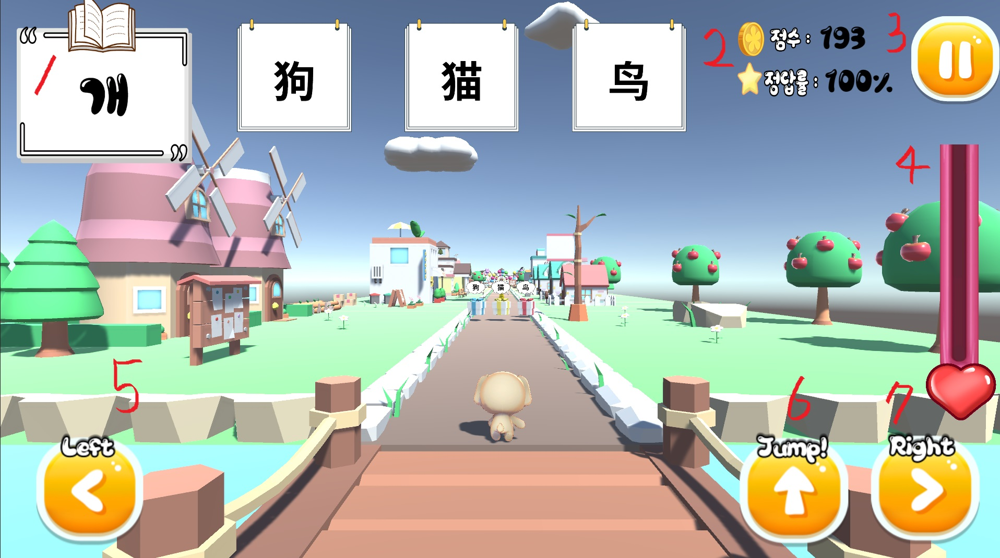
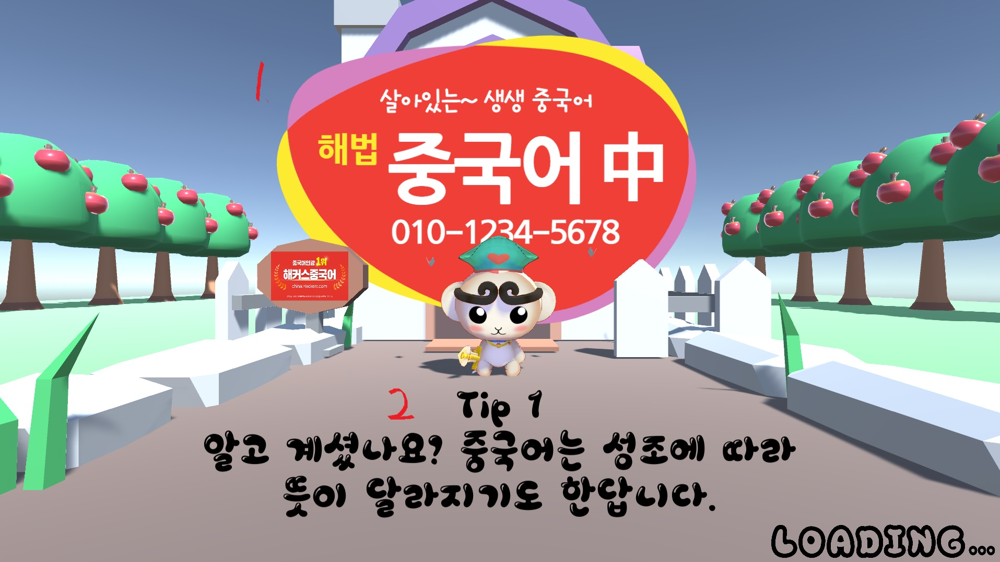

# G-Running
Chinese-language educational game

# How you play it
This game is basically a runner type game. The game character continues to run on the stage. Characters can move left and right and jump. The stage consists of three rails, which select the correct answer to the problem through left and right movement. Different sounds are output depending on whether the answer is correct or not, and at the same time, the pronunciation of the selected Chinese word is also output. You can play Korean and Chinese versions of games through settings. Depending on the correct answer rate and the progress of the game, coins can be obtained, and characters' skins can be bought with coins.

# Title

1. Game Start : You can start a game.
2. Record : You can see the choices and answers you choose for each question.
3. Exit : Exit the game.
4. Shop : Character skins are available for purchase.
5. Dictionary : You can see the words used in the question.
6. Settings : Change various settings in the game. It is also possible to change the game language to Chinese.

# In game play

1. Question : Problems and choices are printed at the top of the game screen.
2. Score and Correct Rate : The scores earned on the stage and the percentage of correct answers to the questions are displayed.
3. Pause : Pause the game.
4. Life Bar : Displays the character's current vitality. If you don't get the correct answer or if you don't get a coin, it decreases.
5. Left Button : Move the character to the left.
6. Jump Button : The character jumps.
7. Right Button : Move the character to the right.

# Loading
 
 
 
 1. Advertising : It displays advertisements such as Chinese academies.
 2. Tips : Provides tips on learning Chinese.

# Warning

This project does not contain files that may cause copyright issues, such as music, graphics, etc.
